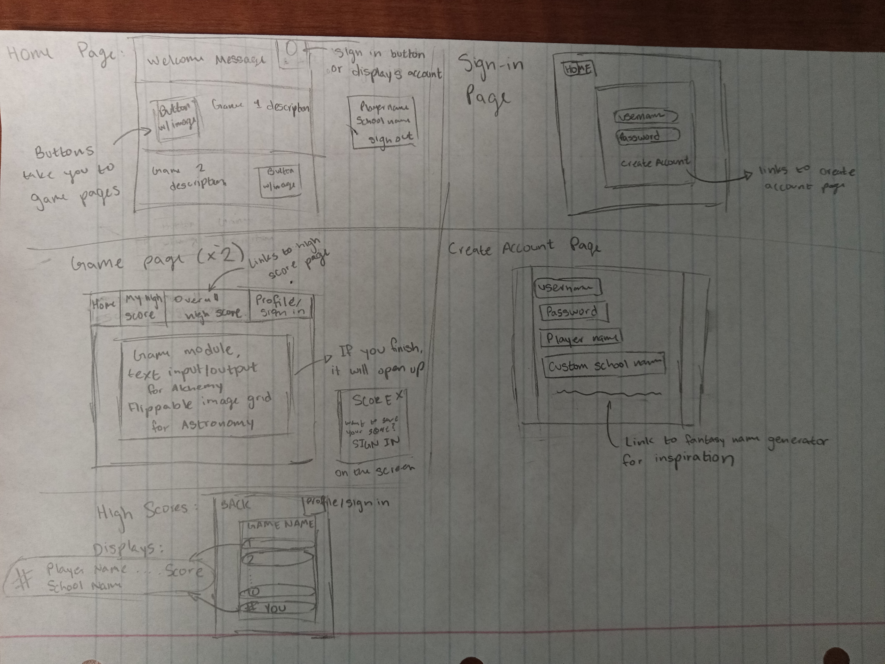

# Magic School Game

[My Notes](notes.md)

This application is a simple game that simulates classes in magic school. It primarily runs on a (few) small minigames with comparative scores.

> [!NOTE]
>  This is a template for your startup application. You must modify this `README.md` file for each phase of your development. You only need to fill in the section for each deliverable when that deliverable is submitted in Canvas. Without completing the section for a deliverable, the TA will not know what to look for when grading your submission. Feel free to add additional information to each deliverable description, but make sure you at least have the list of rubric items and a description of what you did for each item.

> [!NOTE]
>  If you are not familiar with Markdown then you should review the [documentation](https://docs.github.com/en/get-started/writing-on-github/getting-started-with-writing-and-formatting-on-github/basic-writing-and-formatting-syntax) before continuing.

## 🚀 Specification Deliverable

> [!NOTE]
>  Fill in this sections as the submission artifact for this deliverable. You can refer to this [example](https://github.com/webprogramming260/startup-example/blob/main/README.md) for inspiration.

For this deliverable I did the following. I checked the box `[x]` and added a description for things I completed.

- [x] Proper use of Markdown
- [x] A concise and compelling elevator pitch
- [x] Description of key features
- [x] Description of how you will use each technology
- [x] One or more rough sketches of your application. Images must be embedded in this file using Markdown image references.

### Elevator pitch

There are so many fantasical magical schools - and not a one of them are real! Have you ever wished you could attend magic school for yourself? Now you can! In my application, you can build your own magical school. When you log in, you can create a player name, and customize your school. Then, you can enroll in class by playing fun games, and compare your test scores with other players.

### Design

The website will have 7 main pages, though some will be very simple:
- The Home page will include a cute welcome message, something like "Your acceptance letter has been delivered! Welcome to Magic School!". In the corner will be the sign in/view profile/sign out button. If you're signed in, it will display your Player Name and School Name, along with the option to log out. If you are not signed in, it will link you to the sign in page. Below that, it will include the links to the two games, along with descriptions of those two games.
- The Sign in page will include a HOME button, and a simple sign in box, which allows you to enter a username and password. It will also link to the Create Account page
- The Create Account page lets you create a usernmae and password, and also has you enter in a Player Name and School Name of your choosing. On this page, it will also include a link to a third party that generates fun fantasy names, that players can use if they are feeling uninspired.
- There will be two game pages, which will be similar in desgin. They will each have a top bar, which displays a Home page link, your current high score, the overall high score (along with a link to the high score page), and the profile/log in box. In the center of the page will be the game module. When the game is finished, a small pop up screen will appear that displays your score, along with a prompt to "log in" to save your score if you are not logged in.
  - For the Alchemy game, it will include text prompts and repsonses, that will be centered in the page. 
  - For the Astronomy game, it will include a 4x4 grid of "flipped over" pictures, that you can click to flip in a matching game
- There will be two high score pages. It will include a "Back to Game" button, that will take you back to the game, and the profile/log in box. In the center of the page, it will include the top 10 high scores, along with your high score. The high scores will list the Player Name and School Name of the player, and their high score.

### Key features

- A login screen that customizes your playername/username and school name
- 2 mini games that reflect magical classes
  - Alchemy/Potions game
  - Astronomy matching game
  - (Possibly a third, if the implementation of the first two games goes well)
- Your high scores for each mini game is saved
- Comparing high scores between players

### Technologies

I am going to use the required technologies in the following ways.

- **HTML** - Structure of the 7 pages, navigation between pages, some themed images on the home page behind the Welcome Message and the Game navigational buttons, as well as the astonomy images
- **CSS** - Color choices, styling that looks good on different sized screens (but not on a mobile app)
- **React** - Login and create account forms. Runs the game modules based on the user input. 
- **Service** - Retrieves and submits scores. Retrieves the user's Player and School names. Works with the Login/Logout/Create Account pages. High scores will not be saved unless a user is logged in. Calls to the third party website for generating name ideas.
- **DB/Login** - Stores login information, users' high scores, and users' Player and School names.
- **WebSocket** - Renders realtime high score data as users complete games, and updates high scores

## 🚀 AWS deliverable

For this deliverable I did the following. I checked the box `[x]` and added a description for things I completed.

- [x] **Server deployed and accessible with custom domain name** - [My server link](https://daphneplott.click).

## 🚀 HTML deliverable

For this deliverable I did the following. I checked the box `[x]` and added a description for things I completed.

- [x] **HTML pages** - 7 pages were created. There is a home page, a login page, a create account page, two game pages, and two highscore pages.
- [x] **Proper HTML element usage** - The main outline elements were patterned off the Simon index page. I have a head and a body, and the body contains a Header, which includes a Nav menu, a footer, and a main. h tags were used to display page titles, and p tags were used for game descriptions. The high scores pages use ordered lists. The nav bar contains a tags for links to the other pages.
- [x] **Links** - Links were created to link the pages to each other. Every page links to the Home page and the login page. The home page links to the game pages. The game pages link to their highscores, and the highscores back to the game. The login page links to the create account page. The link to my GitHub repository is on the footer in the Home page.
- [x] **Text** - Text was used to provide instructions for the two games, as well as a welcome message on the home page. Text was used as prompts for the create account page.
- [x] **3rd party API placeholder** - The placeholder is included in create_account.html. The 3rd party is for generating fun usernames and school names. I haven't found the site I want to use yet.
- [x] **Images** - The Home page has a magical castle image, the potions pages have a cauldren with green smoke, and the astronomy pages have a starry sky. The images will eventually become background images, not just on the page. There are images embedded in the buttons for the astronomy game.
- [x] **Login placeholder** - A login form is created on both the login page and the create_account page. These forms are slightly different because the create_account page is where you pick your school name. The form is the same layout as the Simon example.
- [x] **DB data placeholder** - The database information will be present on the game high scores page, which will display the top ten players, along with their username, school name, and score. The high score itself will be displayed on the play-game pages. The Database will also be used to remember player logins.
- [x] **WebSocket placeholder** - The WebSocket will be used to update a single user's high score on the play game page. It will also update overall high scores by sending that information to the database. 

## 🚀 CSS deliverable

For this deliverable I did the following. I checked the box `[x]` and added a description for things I completed.

- [x] **Header, footer, and main content body** - Header, footer, and main content have variable display as copied from Simon.
- [x] **Navigation elements** - Navigational elements are spread throughout a navbar, using bootstrap. The background of the navbar will stay on screen as you scroll down. 
- [x] **Responsive to window resizing** - The elements are responsive to window sizing
- [x] **Application elements** - On the front page, the welcome message has a background image, and two cards that link to the games. In the games, the astronomy game has a grid of cards, and the potions game has a drop-down form to pick the ingredients. The application also has a log in and create account forms
- [x] **Application text content** - The text content has been styled. The game instructions have backgrounds to the text to make it more readable.
- [x] **Application images** - The background images are centered and sized well. The images in the astronomy cards have the cards fitted to their size.

## 🚀 React part 1: Routing deliverable

For this deliverable I did the following. I checked the box `[x]` and added a description for things I completed.

- [ ] **Bundled using Vite** - I did not complete this part of the deliverable.
- [ ] **Components** - I did not complete this part of the deliverable.
- [ ] **Router** - I did not complete this part of the deliverable.

## 🚀 React part 2: Reactivity deliverable

For this deliverable I did the following. I checked the box `[x]` and added a description for things I completed.

- [ ] **All functionality implemented or mocked out** - I did not complete this part of the deliverable.
- [ ] **Hooks** - I did not complete this part of the deliverable.

## 🚀 Service deliverable

For this deliverable I did the following. I checked the box `[x]` and added a description for things I completed.

- [ ] **Node.js/Express HTTP service** - I did not complete this part of the deliverable.
- [ ] **Static middleware for frontend** - I did not complete this part of the deliverable.
- [ ] **Calls to third party endpoints** - I did not complete this part of the deliverable.
- [ ] **Backend service endpoints** - I did not complete this part of the deliverable.
- [ ] **Frontend calls service endpoints** - I did not complete this part of the deliverable.
- [ ] **Supports registration, login, logout, and restricted endpoint** - I did not complete this part of the deliverable.

## 🚀 DB deliverable

For this deliverable I did the following. I checked the box `[x]` and added a description for things I completed.

- [ ] **Stores data in MongoDB** - I did not complete this part of the deliverable.
- [ ] **Stores credentials in MongoDB** - I did not complete this part of the deliverable.

## 🚀 WebSocket deliverable

For this deliverable I did the following. I checked the box `[x]` and added a description for things I completed.

- [ ] **Backend listens for WebSocket connection** - I did not complete this part of the deliverable.
- [ ] **Frontend makes WebSocket connection** - I did not complete this part of the deliverable.
- [ ] **Data sent over WebSocket connection** - I did not complete this part of the deliverable.
- [ ] **WebSocket data displayed** - I did not complete this part of the deliverable.
- [ ] **Application is fully functional** - I did not complete this part of the deliverable.
